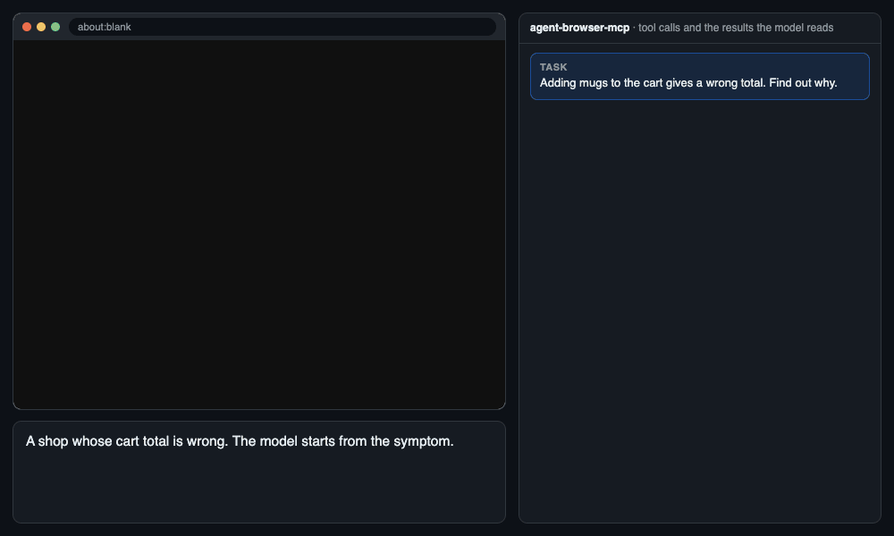
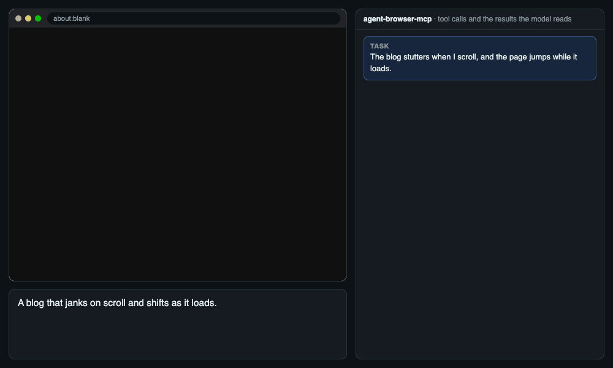
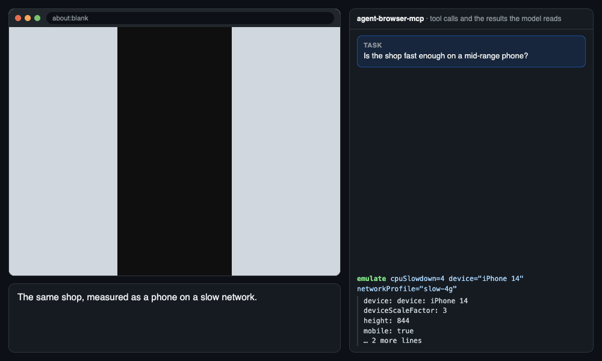

# agent-browser-mcp

**Chrome DevTools for AI agents.** An [MCP](https://modelcontextprotocol.io/) server that lets Claude, or any MCP client, debug, profile and test websites the way a developer does in DevTools, through the [agent-browser](https://github.com/vercel-labs/agent-browser) CLI.



<sub>Scripted calls, real results: [docs/demo](docs/demo) drives this server over stdio against a local demo page.</sub>

## What it can do

- **Debug from a symptom.** Line, conditional, function, DOM, XHR, event and CSP breakpoints; stepping; scope and watch; async call stacks; source-mapped original files. A click that hits a breakpoint returns the paused line straight away.
- **Try a fix without touching your files.** `edit_source` serves an edited script in place of the original and reloads, like DevTools Local Overrides.
- **Explain why something looks wrong.** The CSS rules that apply and which ones lose, computed values, the box model, the accessibility name and role, and WCAG contrast. It can also force `:hover`, show grid and flex overlays, and make live edits.
- **Find out why a page is slow.**
  - Web Vitals, rated against Google's thresholds
  - a filmstrip of the load
  - traces with LCP, layout-shift and render-blocking insights
  - CPU profiles (self and total time), a main-thread heatmap
  - JS/CSS coverage and Lighthouse
- **Find jank and layout jumps.** Paint flashing, layout-shift regions, the FPS meter, and running animations you can slow down or pause.
- **Track down memory leaks.** Heap snapshots compared by constructor, retainer paths that name the variable holding the object, and live object counts.
- **Trace network problems.** Each request's initiator, which cookies were sent or blocked and why, WebSocket and EventSource messages, copy as cURL or fetch, replay, mocking and blocking, and HAR files.
- **Test on other devices.** Phones, slow networks and CPUs, dark mode, print, locales, timezones, vision deficiencies, a disabled cache, and a virtual passkey authenticator.
- **Inspect storage.** IndexedDB, Cache Storage, service workers, the manifest, cookies, the back/forward cache test, and the certificate.
- **Turn a session into a test.** Record what the model does and export it as a Playwright test or a Puppeteer script.
- **Notice problems unasked.** Every page load reports its uncaught JS errors and failed requests, so the model follows up without being told.
- **Reach the rest of DevTools.** The `cdp` tool sends any DevTools Protocol command (Layers, Media, WebAudio, and more).

### More demos

**"The blog stutters when I scroll, and the page jumps while it loads."** Rendering overlays outline the layout shift, Web Vitals measure it, and a CPU profile names the scroll handler.



**"Is the shop fast enough on a mid-range phone?"** Phone emulation, Web Vitals, JS/CSS coverage and a Lighthouse audit, in the same browser.



## How it differs from Claude in Chrome

Both let Claude use a browser, but they do different jobs, and they work well side by side.

| | Claude in Chrome | agent-browser-mcp |
|---|---|---|
| **Built for** | Doing tasks in your everyday Chrome: browsing, forms, reading pages | Building and fixing websites: debugging, profiling and testing them |
| **Browser** | Your own Chrome, with your tabs and logins, through an extension | A separate browser the agent controls: visible or headless, one per session, or your profile if you choose |
| **Sees the page through** | Screenshots, page reading, console and network logs | The accessibility tree with `@ref`s, plus the DevTools panels as text |
| **JavaScript debugger** (breakpoints, stepping, scope, source maps) | — | ✓ |
| **Performance** (traces, CPU profiles, filmstrip, Web Vitals, Lighthouse, coverage) | — | ✓ |
| **Memory** (heap snapshots, diffs, retainers) | — | ✓ |
| **Elements** (CSS cascade, computed, box model, contrast, forced states) | — | ✓ |
| **Emulation** (devices, network and CPU throttling, media features, locale) | — | ✓ |
| **Network control** (mock, block, HAR, replay, initiators, cookie reasons) | Reads requests | ✓ |
| **Exports a test** | GIF of the session | Playwright or Puppeteer script |
| **Works with** | Claude apps with the extension | Any MCP client: Claude Code, Claude Desktop, Cursor, Cline… |

Use Claude in Chrome when you want Claude to act in your own browser. Use agent-browser-mcp when the website itself is the work.

## Why it's efficient

- **Small, lazy schema.** 43 tools in about 11.6k tokens. Claude Code loads a tool's schema only when it's first needed.
- **Text, not pixels.** An accessibility snapshot of a page costs a few hundred tokens. A screenshot is used only when you need to see the page.
- **Act by reference.** The model clicks `@e5` from the snapshot, with no coordinates to guess and no retries when the layout shifts.
- **Only what changed.** `snapshot:"diff"` on any action returns just the lines that changed, and `delta` returns just the changed refs.
- **Summaries, not dumps.** Traces, CPU profiles, heap snapshots and Lighthouse reports come back as a few ranked lines: the long tasks, the top functions, what grew. The full files stay on disk.
- **Fewer round trips.** `batch` runs several known steps in one call, and a page load reports its own errors, so the model rarely has to ask.
- **Guided by symptom.** The server's instructions map symptoms to the right tool ("slow" → vitals, "looks wrong" → styles and contrast), so the model doesn't try tools at random.
- **Bounded output.** Every result is capped (`--max-output`), and long lists can be narrowed with `pattern` and `limit`.
- **Light on your machine.** The model stays in one browser, and a window left idle for 15 minutes closes itself, so forgotten browsers don't keep the CPU busy and the fans spinning.
- **Exits cleanly.** On reconnect the server stops at once and releases its browser connections.

## Quick start

1. Install the [agent-browser](https://github.com/vercel-labs/agent-browser) CLI **0.38.0 or newer** and its browser:

   ```bash
   npm install -g agent-browser@latest
   agent-browser install
   ```

2. Build the server (Go 1.26+):

   ```bash
   git clone https://github.com/akash-aman/agentbrowser-mcp.git
   cd agentbrowser-mcp
   go build -o agent-browser-mcp .
   ```

3. Add it to your MCP client. For Claude Code:

   ```bash
   claude mcp add agent-browser -- "$PWD/agent-browser-mcp" --headed
   ```

   For Claude Desktop, Cursor, Cline and other clients:

   ```json
   {
     "mcpServers": {
       "agent-browser": { "command": "/path/to/agent-browser-mcp", "args": ["--headed"] }
     }
   }
   ```

4. Describe the problem, not the tool:
   - "Checkout on localhost:3000 fails. Find out why."
   - "Is this page fast enough on a mid-range phone?"
   - "The feed stutters when I scroll."

- **`--headed`:** shows the browser window; leave it out to run headless.
- **Optional:** [Lighthouse](https://github.com/GoogleChrome/lighthouse) (`npm install -g lighthouse`) for audits, and ffmpeg for `record`.

## Tools

Every tool takes an optional `session`. Leave it out to use the current browser; a new name opens another browser.

| Toolset | Tools |
|---|---|
| **core** (always on) | `navigate` · `snapshot` · `page_text` · `get` · `find` · `click` · `fill` · `type` · `press_key` · `select_option` · `drag` · `scroll` · `element_action` · `mouse` · `upload_file` · `download` · `wait` · `screenshot` · `tabs` · `dialog` · `console` · `eval_script` · `batch` · `close_browser` · `help` |
| **network** | `network`: request log and detail, mock or block, HAR; capture for initiators, cookie decisions, WebSocket/EventSource messages, copy as cURL or fetch, replay and search |
| **devtools** | `debugger` · `elements` · `performance` · `debug_ui` (rendering overlays, animations, Chrome's DevTools window) · `react` · `record` (video, or a Playwright/Puppeteer flow) · `diff` · `save_pdf` · `cdp` |
| **emulation** | `emulate`: device, viewport, geolocation, offline, headers, HTTP auth, color scheme, reduced motion, print, vision deficiencies, locale, timezone, user agent, JavaScript or cache off, focus, passkey authenticator, network and CPU throttling |
| **storage** | `cookies` · `storage` · `state` · `clipboard` · `session` · `auth` (saved logins; secrets never pass through the model) · `application` |

<details>
<summary>Behaviours worth knowing</summary>

- **`eval_script`** runs like the DevTools Console: a script may declare the same `const` again, promises are awaited, and DOM nodes print as `div#app`.
- **Click while debugging:** an action that triggers a breakpoint returns the paused location. That includes a pause just after the action, such as from a `setTimeout`.
- **Hidden elements:** `click`, `fill`, `type` and hover refuse an element that isn't visible, where agent-browser would report success.
- **Editing shortcuts:** `press_key` with Control or Meta plus a, c, x, v, z or y selects all, copies, cuts, pastes, undoes or redoes, on macOS too.
- **New windows:** `tabs new_window` opens a window with its own cookies and storage, for testing a second user. Downloads work there too.
- **Recorded flows:** `record flow_export` can be called again for the other format, and the flow keeps recording.
- **Source maps:** a breakpoint can name an original file (`src/cart.ts:12`), and pauses show the authored source.

</details>

<details>
<summary>Chrome DevTools coverage</summary>

| DevTools | agent-browser-mcp |
|---|---|
| **Elements**: Styles, Computed, Layout overlays, Accessibility, contrast, `:hov`, edit as HTML, copy selector/XPath, DOM search, CSS Overview | `elements` |
| **Elements**: Event Listeners, DOM breakpoints | `debugger` listeners, dom_breakpoint |
| **Console**: logs, errors, Issues, iframe and worker contexts | `console`, `eval_script` |
| **Sources**: breakpoints of every kind, stepping, Call Stack, Scope, Watch, search, source maps, ignore list | `debugger` |
| **Sources**: Overrides | `debugger` edit_source / revert_source |
| **Network**: requests, headers, throttling, blocking, mocking, HAR, initiator, cookies, WebSocket, copy as cURL/fetch, replay | `network`, `emulate` |
| **Performance**: recording, insights, Bottom-Up and Call Tree, filmstrip, Web Vitals | `performance` |
| **Memory**: heap snapshots, comparison, retainers, `queryObjects()` | `performance` |
| **Application**, **Security** | `application`, `cookies`, `storage` |
| **Lighthouse**, **Recorder**, **Coverage**, **Animations**, **Performance monitor** | `performance`, `record`, `debug_ui` |
| **Rendering**, **Sensors**, **device toolbar**, **WebAuthn** | `debug_ui` rendering, `emulate`, `application` credentials |
| **Protocol monitor** and the long tail (Layers, Media, WebAudio, Autofill…) | `cdp` |
| React DevTools | `react` (with `--enable react-devtools`) |

**Not covered:** parts that serve a person at the keyboard, or that the model does itself:
- AI assistance and Console Insights
- Workspace and Snippets
- the font and color editors
- `$0`
- remote devices
- Lighthouse's timespan and snapshot modes

</details>

## Configuration

Every setting can come from an environment variable or a flag; flags win.

| Environment variable | Flag | Default | Description |
|---|---|---|---|
| `AGENT_BROWSER_HEADED` | `--headed` | `false` | Show the browser window |
| `AGENT_BROWSER_MCP_TOOLSETS` | `--toolsets` | `all` | `all`, or a comma list of `core`, `network`, `devtools`, `emulation`, `storage` |
| `AGENT_BROWSER_MCP_IDLE_TIMEOUT` | `--idle-timeout` | `15m` | Close a session's browser after this long without commands (`0` = never) |
| `AGENT_BROWSER_PROFILE` | `--profile` | — | Chrome profile name or directory, for persistent logins |
| `AGENT_BROWSER_ENABLE` | `--enable` | — | Built-in init scripts, e.g. `react-devtools` (needed by `react`) |
| `AGENT_BROWSER_MCP_PROJECT` / `_PURPOSE` | `--project` / `--purpose` | — | What this browser is for, shown to the model |

<details>
<summary>All settings</summary>

| Environment variable | Flag | Default | Description |
|---|---|---|---|
| `AGENT_BROWSER_MCP_NAME` | `--name` | `agent-browser-mcp` | Server identity name |
| `AGENT_BROWSER_MCP_PROJECT` | `--project` | — | Project this browser serves |
| `AGENT_BROWSER_MCP_PURPOSE` | `--purpose` | — | Purpose of this instance |
| `AGENT_BROWSER_MCP_TOOLSETS` | `--toolsets` | `all` | Enabled toolsets; core is always on |
| `AGENT_BROWSER_MCP_SESSION` | `--session` | — | Default session name |
| `AGENT_BROWSER_MCP_IDLE_TIMEOUT` | `--idle-timeout` | `15m` | Close an idle session's browser (`0` = agent-browser's default) |
| `AGENT_BROWSER_MCP_CLOSE_ON_EXIT` | `--close-on-exit` | `false` | Close this server's sessions when it stops. Off by default, so a reconnect keeps your browser, page and logins |
| `AGENT_BROWSER_MCP_TIMEOUT` | `--timeout` | `60000` | Command timeout in ms |
| `AGENT_BROWSER_MCP_MAX_OUTPUT` | `--max-output` | `40000` | Max characters per tool result (`0` = unlimited) |
| `AGENT_BROWSER_MCP_BROWSER_PATH` | `--agent-browser-path` | `agent-browser` | agent-browser binary |
| `AGENT_BROWSER_MCP_LIGHTHOUSE_PATH` | `--lighthouse-path` | `lighthouse` | Lighthouse CLI |
| `AGENT_BROWSER_HEADED` | `--headed` | `false` | Show the browser window |
| `AGENT_BROWSER_SESSION_NAME` | `--session-name` | — | Auto-save and restore cookies and storage under this name |
| `AGENT_BROWSER_PROFILE` | `--profile` | — | Chrome profile name or directory |
| `AGENT_BROWSER_STATE` | `--state` | — | Storage state file to load |
| `AGENT_BROWSER_AUTO_CONNECT` | `--auto-connect` | `false` | Attach to a running Chrome |
| `AGENT_BROWSER_CDP` | `--cdp` | — | Attach on this CDP port or URL |
| `AGENT_BROWSER_ENGINE` | `--engine` | — | `chrome` or `lightpanda` |
| `AGENT_BROWSER_PROVIDER` | `--provider` | — | `browserless`, `browserbase`, `browseruse`, `kernel`, `agentcore`, `ios` |
| `AGENT_BROWSER_EXECUTABLE_PATH` | `--executable-path` | — | Custom browser binary |
| `AGENT_BROWSER_ARGS` | `--browser-args` | — | Extra browser launch args, comma-separated |
| `AGENT_BROWSER_PROXY` | `--proxy` | — | Proxy URL |
| `AGENT_BROWSER_PROXY_BYPASS` | `--proxy-bypass` | — | Hosts that skip the proxy |
| `AGENT_BROWSER_USER_AGENT` | `--user-agent` | — | User-Agent at launch |
| `AGENT_BROWSER_INPUT_MODE` | `--input-mode` | CLI default (`instant`) | Pointer movement for every action: `instant`, `smooth` or `human` |
| `AGENT_BROWSER_EXTENSIONS` | `--extensions` | — | Extension paths, comma-separated |
| `AGENT_BROWSER_INIT_SCRIPTS` | `--init-scripts` | — | Scripts run before page scripts, comma-separated |
| `AGENT_BROWSER_ENABLE` | `--enable` | — | Built-in init scripts, e.g. `react-devtools` (needed by `react`) |
| `AGENT_BROWSER_DOWNLOAD_PATH` | `--download-path` | — | Default download directory |
| `AGENT_BROWSER_IGNORE_HTTPS_ERRORS` | `--ignore-https-errors` | `false` | Ignore certificate errors |
| `AGENT_BROWSER_NO_AUTO_DIALOG` | `--no-auto-dialog` | `false` | Keep alerts open for the `dialog` tool |
| `AGENT_BROWSER_ALLOWED_DOMAINS` | `--allowed-domains` | — | Restrict navigation to these domains |
| `AGENT_BROWSER_ACTION_POLICY` | `--action-policy` | — | Action policy JSON file |
| `AGENT_BROWSER_CONTENT_BOUNDARIES` | `--content-boundaries` | `false` | Mark page output to resist prompt injection |
| `AGENT_BROWSER_CONFIG` | `--config` | — | agent-browser.json config file |

</details>

**Use your own logged-in Chrome.** Recent Chrome refuses remote debugging on the default profile, so:
- **Dedicated profile:** `--profile ~/.agent-browser/chrome`, then log in once with `--headed`.
- **Copy logins once:** `agent-browser --auto-connect state save ~/auth.json`, then start with `--state ~/auth.json`.
- **Attach:** `--cdp 9222`, `--auto-connect`, or the `session` tool's `connect` action.

## How it works

```
MCP client ⇄ stdio ⇄ agent-browser-mcp ─┬─ agent-browser CLI (--json) ─ Chrome
                                         └─ Chrome DevTools Protocol ───┘
```

- **CLI path:** page actions run `agent-browser <command> --json`. Results are reshaped into short text, or an image for screenshots.
- **CDP path:** the debugger, elements, performance, application, console Issues, `eval_script`, the clipboard, throttling and the rendering overlays talk to Chrome directly, with one connection per session.
- **While paused:** other tools answer "resume first" instead of hanging.
- **Closed browsers:** if the idle timeout closed a browser, the next call says so before it starts a fresh one.
- **agent-browser gaps handled here:**
  - downloads in a new window
  - `state rename`
  - snapshot diffs that never kept a baseline
  - importing a `Cookie:` header
  - copy and paste that changed nothing
  - a device's user agent that wouldn't reset

## Compatibility

| agent-browser-mcp | agent-browser CLI | Tested with |
|---|---|---|
| 2.x | 0.38.0 or newer | 0.38.2 |

The server checks `agent-browser --version` at startup and warns if the CLI is older. `help {topic:"doctor"}` reports it too.

<details>
<summary>Upgrading from 1.x</summary>

2.0 merges about 150 single-purpose tools into about 40 tools with an `action`, `by` or `what` parameter. For example, `find_by_text_click` became `find {by:"text", action:"click"}` and `get_page_title` became `get {what:"title"}`. The old tool names are gone.

</details>

## Development

```bash
go test ./...                                     # fake CLI and fake Chrome, a few seconds
go test -tags integration ./internal/mcp/tools/   # a real browser against local fixture pages
go build -o agent-browser-mcp . && go run docs/demo/main.go   # re-record the demo GIFs
```

- **Fakes:** unit tests run every tool against a fake agent-browser that records its arguments, and a fake Chrome that records protocol calls.
- **Guards:** coverage tests fail if a tool or enum value has no test case. Budget tests keep `tools/list` under 48 KB and the instructions under Claude Code's 2,048-character limit.
- **Lighthouse:** set `LIGHTHOUSE_PATH=$(which lighthouse)` to include the Lighthouse audit in the integration run.

## License

MIT. See [LICENSE](./LICENSE).
